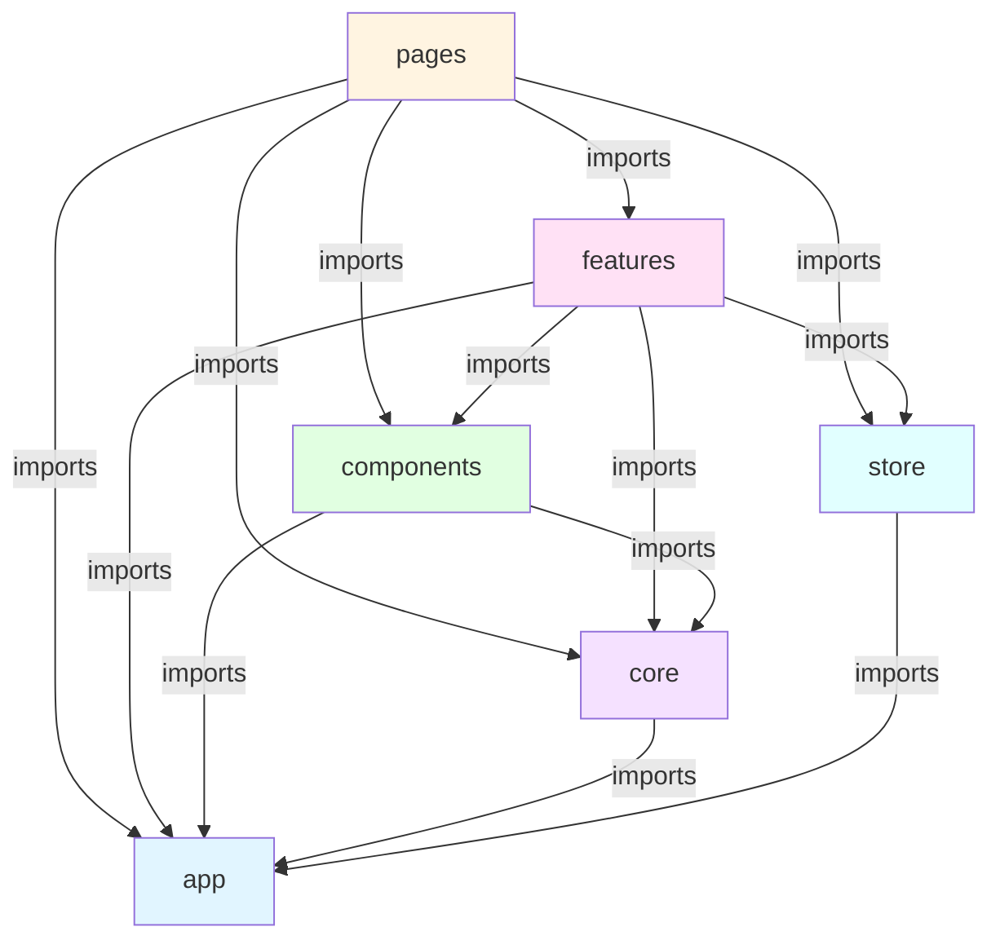

# Project Architecture

## Table of Contents

- [Structure Principles](#structure-principles)
    - [Layer Hierarchy (Top to Bottom)](#layer-hierarchy-top-to-bottom)
- [Project Structure](#project-structure)
- [Import Rules](#import-rules)
    - [Allowed Imports (↓ can import from ↓)](#allowed-imports--can-import-from-)
- [Folder Responsibilities](#folder-responsibilities)
    - [App Folder](#app-folder)
    - [Components Folder](#components-folder)
    - [Layout Folder](#layout-folder)
        - [Layout Responsibilities](#layout-responsibilities)
        - [Layout Examples](#layout-examples)
    - [Pages Folder](#pages-folder)
        - [Page Responsibilities](#page-responsibilities)
        - [Page Best Practices](#page-best-practices)
        - [Page Store](#page-store)
    - [Features Folder](#features-folder)
        - [Feature Responsibilities](#feature-responsibilities)
        - [Feature Best Practices](#feature-best-practices)
    - [Core Folder](#core-folder)
        - [Core Layer Dependencies](#core-layer-dependencies)
    - [Store Folder](#store-folder)
        - [Store Responsibilities](#store-responsibilities)
        - [Store Rules](#store-rules)
        - [Store Best Practices](#store-best-practices)

## Structure Principles

### Layer Hierarchy (Top to Bottom)

1. **app** - Application configuration, assets, constants, enums, and utilities
2. **pages** - Complete application pages with page-specific business logic and route mapping
3. **features** - Shared business logic and features used across the application
4. **components** - Reusable UI components
5. **core** - React-specific shared resources
6. **store** - Global application state management

### Layer Dependencies Diagram

The following diagram illustrates the dependency relationships between layers. Arrows indicate allowed import directions (higher layers can import from lower layers):



**Key Rules:**

- **Downward dependencies only**: Higher layers can import from lower layers, but not the reverse
- **No circular dependencies**: Each layer must maintain a clear dependency hierarchy
- **Store is accessible**: Both `pages` and `features` can access the global store
- **App is foundational**: All layers can depend on `app` (configs, constants, enums, utils), but `app` has no dependencies

## Project Structure

```text
📁 src/
├── 📁 app/          # Application configuration, assets, constants, enums, and utilities
│   ├── 📁 assets/   # Images, fonts, icons
│   ├── 📁 configs/  # App, API, routes configuration
│   ├── 📁 constants/# Application constants
│   ├── 📁 enums/    # TypeScript enums
│   ├── 📁 utils/    # Utility functions
│   └── 📁 styles/   # Global styles
│
├── 📁 pages/        # Complete application pages
│   ├── 📁 accounts/
│   │   ├── 📁 store/  # Page-specific state (optional)
│   │   └── ...
│   ├── 📁 auth/
│   └── ...
│
├── 📁 features/     # Business logic and features
│   ├── 📁 accounts/
│   │   ├── 📁 account-list/
│   │   ├── 📁 account-create/
│   │   ├── 📁 apis/
│   │   ├── 📁 models/
│   │   └── ...
│   ├── 📁 auth/
│   └── ...
│
├── 📁 components/   # Reusable UI components
│   ├── 📁 button/
│   ├── 📁 modal/
│   ├── 📁 form/
│   └── ...
│
├── 📁 core/         # React-specific shared resources
│   ├── 📁 hooks/
│   ├── 📁 contexts/
│   ├── 📁 apis/
│   └── 📁 guards/
│
├── 📁 store/        # Global application state management
│   ├── 📁 auth/     # Authentication state slice
│   ├── 📁 user/     # User state slice
│   └── 📄 index.ts  # Store configuration and root reducer
│
├── 📄 main.tsx
└── 📄 app.tsx
```

## Import Rules

### Allowed Imports (↓ can import from ↓)

```text
pages      → features, components, core, store, app
features   → components, core, store, app
components → core, app
core       → app
store      → app
app        → (no imports from other layers)
```

## Folder Responsibilities

### App Folder

Contains application-wide configurations, static assets, constants, enums, and utilities:

```typescript
// app/config/app.config.ts
export const appConfig = {
    appName: 'Admin Dashboard',
    version: '1.0.0',
    environment: import.meta.env.MODE,
    features: {
        enableNewAccountFlow: true,
        enableSubscriptions: true,
    },
};

// app/config/api.config.ts
export const apiConfig = {
    baseURL: import.meta.env.VITE_API_URL,
    timeout: 30000,
    headers: {
        'Content-Type': 'application/json',
    },
};

// app/config/routes.config.ts
export const routesConfig = {
    home: '/',
    accounts: {
        list: '/accounts',
        detail: '/accounts/:id',
    },
    subscriptions: {
        list: '/subscriptions',
        detail: '/subscriptions/:id',
    },
    auth: {
        login: '/login',
        register: '/register',
    },
};
```

### Components Folder

Pure UI components without business logic:

```typescript
// components/button/button.tsx
import { ButtonHTMLAttributes } from 'react';
import { cn } from '@/app/utils/tailwind.utils';
import styles from './button.module.css';

interface ButtonProps extends ButtonHTMLAttributes<HTMLButtonElement> {
  variant?: 'primary' | 'secondary' | 'danger';
  size?: 'small' | 'medium' | 'large';
}

export const Button = ({
  variant = 'primary',
  size = 'medium',
  className,
  children,
  ...props
}: ButtonProps) => {
  return (
    <button
      className={cn(
        styles.button,
        styles[variant],
        styles[size],
        className
      )}
      {...props}
    >
      {children}
    </button>
  );
};
```

### Layout Folder

Layout components that provide structural containers for pages.

#### Layout Responsibilities

- **Page Containers**: Provide consistent structural containers that accommodate multiple pages
- **Layout Consistency**: Ensure consistent spacing, positioning, and visual structure across pages
- **Responsive Structure**: Handle responsive layout behavior and breakpoints

#### Layout Examples

```typescript
// components/layout/page-layout.tsx
import { ReactNode } from 'react';
import { Header } from './header';
import { Footer } from './footer';
import { Sidebar } from './sidebar';

interface PageLayoutProps {
  children: ReactNode;
  title?: string;
  showSidebar?: boolean;
  headerActions?: ReactNode;
}

export const PageLayout = ({
  children,
  title,
  showSidebar = true,
  headerActions
}: PageLayoutProps) => {
  return (
    <div className="min-h-screen flex flex-col">
      <Header title={title} actions={headerActions} />

      <div className="flex flex-1">
        {showSidebar && <Sidebar />}

        <main className="flex-1 p-6">
          {children}
        </main>
      </div>

      <Footer />
    </div>
  );
};

// components/layout/auth-layout.tsx
export const AuthLayout = ({ children }: { children: ReactNode }) => {
  return (
    <div className="min-h-screen flex items-center justify-center bg-gray-50">
      <div className="max-w-md w-full space-y-8">
        <div className="text-center">
          
        </div>
        {children}
      </div>
    </div>
  );
};
```

### Pages Folder

Complete page components that compose features and components. Pages can contain business logic that is specific to that page and not reused across the application.

```typescript
// pages/accounts/accounts-page.tsx
import { useState } from 'react';
import { PageLayout } from '@/components/layout';
import { Button } from '@/components/button';
import { AccountList } from '@/features/accounts/account-list';
import { CreateAccountModal } from '@/features/accounts/account-create';
import { useAuth } from '@/core/hooks';

export const AccountsPage = () => {
  const [isCreateModalOpen, setIsCreateModalOpen] = useState(false);
  const { hasPermission } = useAuth();

  return (
    <PageLayout title="Accounts">
      <div className="page-header">
        <h1>Accounts Management</h1>
        {hasPermission('accounts.create') && (
          <Button
            variant="primary"
            onClick={() => setIsCreateModalOpen(true)}
          >
            Create Account
          </Button>
        )}
      </div>

      <AccountList />

      <CreateAccountModal
        isOpen={isCreateModalOpen}
        onClose={() => setIsCreateModalOpen(false)}
      />
    </PageLayout>
  );
};

// pages/accounts/account-details-page.tsx
import { useParams, useNavigate } from 'react-router-dom';
import { PageLayout } from '@/components/layout';
import { AccountDetails } from '@/features/accounts/account-details';
import { UpdateAccountModal } from '@/features/accounts/account-update';
import { useAccount } from '@/features/accounts/hooks';

export const AccountDetailsPage = () => {
  const { id } = useParams<{ id: string }>();
  const navigate = useNavigate();
  const { account, isLoading, error } = useAccount(id);

  if (isLoading) return <PageLayout><div>Loading...</div></PageLayout>;
  if (error) return <PageLayout><div>Error loading account</div></PageLayout>;

  return (
    <PageLayout title={`Account: ${account?.name}`}>
      <Button onClick={() => navigate('/accounts')}>
        Back to List
      </Button>

      <AccountDetails account={account} />
    </PageLayout>
  );
};

// pages/timeline/timeline-page.tsx
// Example: Page-specific business logic that is not reused
import { useState, useEffect } from 'react';
import { PageLayout } from '@/components/layout';
import { TimelinePeriodList } from './components/timeline-period-list';
import { timelineApi } from './apis';

export const TimelinePage = () => {
  const [periods, setPeriods] = useState([]);
  const [selectedPeriodId, setSelectedPeriodId] = useState(null);

  // Page-specific logic: Fetching and managing timeline state
  // This logic is specific to this page and not reused elsewhere
  useEffect(() => {
    const fetchPeriods = async () => {
      const data = await timelineApi.getPeriods();
      setPeriods(data);
    };
    fetchPeriods();
  }, []);

  // Page-specific logic: Route-based period selection
  const handlePeriodSelect = (periodId: string) => {
    setSelectedPeriodId(periodId);
    // Update URL without navigation (page-specific routing logic)
    window.history.replaceState({}, '', `/timeline/${periodId}`);
  };

  return (
    <PageLayout title="Timeline">
      <TimelinePeriodList
        periods={periods}
        selectedPeriodId={selectedPeriodId}
        onPeriodSelect={handlePeriodSelect}
      />
    </PageLayout>
  );
};
```

#### Page Responsibilities

- **Route Mapping**: Handle route parameters, URL state, and navigation logic specific to the page
- **Page-Specific Business Logic**: Can contain business logic that is unique to the page and not reused across the application
- **Composition**: Pages compose features and components together
- **Authorization**: Check permissions and access control at page level
- **Data Orchestration**: Coordinate multiple features on the same page
- **Error Boundaries**: Handle page-level errors and loading states

#### Page Best Practices

```typescript
// ✅ Good: Page with page-specific business logic
export const TimelinePage = () => {
  // Page-specific state management
  const [selectedPeriodId, setSelectedPeriodId] = useState(null);

  // Page-specific route handling
  const { periodId } = useParams();
  useEffect(() => {
    if (periodId) {
      setSelectedPeriodId(periodId);
    }
  }, [periodId]);

  // Page-specific logic for URL synchronization
  const handlePeriodChange = (id: string) => {
    setSelectedPeriodId(id);
    navigate(`/timeline/${id}`);
  };

  return (
    <PageLayout>
      <TimelinePeriodList
        selectedPeriodId={selectedPeriodId}
        onPeriodChange={handlePeriodChange}
      />
    </PageLayout>
  );
};

// ✅ Good: Page that orchestrates features
export const AccountsPage = () => {
  return (
    <PageLayout>
      <AccountList />
      <CreateAccountButton />
    </PageLayout>
  );
};

// ❌ Bad: Reusable business logic in pages (should be in features)
export const AccountsPage = () => {
  // This reusable logic should be in features/accounts/
  const handleCreateAccount = async (data) => {
    await api.post('/accounts', data);
    // Reusable logic that other pages might need
  };

  return (/*...*/);
};
```

#### Page Store

For complex page-specific state that needs to be managed with Redux, you can create a page store at `src/pages/{page}/store/`. Use page stores only when:

- State is complex and benefits from Redux patterns (multiple reducers, middleware, etc.)
- State needs to persist across page remounts
- State management logic is too complex for `useState` or `useReducer`

**Structure:**

```text
pages/
├── timeline/
│   ├── store/
│   │   ├── timeline.slice.ts
│   │   └── index.ts
│   └── timeline-page.tsx
```

**Example:**

```typescript
// pages/timeline/store/timeline.slice.ts
import { createSlice, PayloadAction } from '@reduxjs/toolkit';

export interface ITimelineState {
    selectedPeriodId: string | null;
    filters: {
        dateRange: { start: string; end: string } | null;
        category: string | null;
    };
}

const timelineSlice = createSlice({
    name: 'timeline',
    initialState: {
        selectedPeriodId: null,
        filters: { dateRange: null, category: null },
    } as ITimelineState,
    reducers: {
        setSelectedPeriod: (state, action: PayloadAction<string>) => {
            state.selectedPeriodId = action.payload;
        },
        setFilters: (state, action: PayloadAction<ITimelineState['filters']>) => {
            state.filters = action.payload;
        },
    },
});

export const { setSelectedPeriod, setFilters } = timelineSlice.actions;
export default timelineSlice.reducer;
```

**When NOT to use Page Store:**

- Simple state that can be managed with `useState`
- State that needs to be shared with other pages (use global store instead)
- Temporary UI state (use component state)

### Features Folder

Business logic and feature-specific components that are **shared across the application**. Features accommodate reusable business logic that can be used by multiple pages or components.

```typescript
// features/accounts/account-create/create-account-modal.tsx
import { useState } from 'react';
import { Modal } from '@/components/modal';
import { useCreateAccount } from './use-create-account';
import { CreateAccountForm } from './create-account-form';

export const CreateAccountModal = ({ isOpen, onClose }) => {
  const { create, isLoading } = useCreateAccount();

  const handleSubmit = async (data) => {
    await create(data);
    onClose();
  };

  return (
    <Modal isOpen={isOpen} onClose={onClose} title="Create Account">
      <CreateAccountForm onSubmit={handleSubmit} isLoading={isLoading} />
    </Modal>
  );
};

// features/accounts/account-create/use-create-account.ts
// Reusable business logic that can be used across multiple pages
import { useMutation } from 'react-query';
import { useDispatch } from 'react-redux';
import { apiClient } from '@/core/apis';
import { API_ENDPOINTS } from '@/app/constants';
import { addAccount } from '../store';

export const useCreateAccount = () => {
  const dispatch = useDispatch();

  const mutation = useMutation(
    (data) => apiClient.post(API_ENDPOINTS.accounts.create, data),
    {
      onSuccess: (account) => {
        dispatch(addAccount(account));
      }
    }
  );

  return {
    create: mutation.mutate,
    isLoading: mutation.isLoading,
    error: mutation.error
  };
};

// features/auth/auth.service.ts
// Shared business logic for authentication across the application
import { apiClient } from '@/core/apis';
import { LoginRequestModel, LoginResponseModel } from './models';

export const authService = {
  async login(credentials: LoginRequestModel): Promise<LoginResponseModel> {
    const response = await apiClient.post('/auth/login', credentials);
    return response.data;
  },

  async logout(): Promise<void> {
    await apiClient.post('/auth/logout');
  },
} as const;
```

#### Feature Responsibilities

- **Shared Business Logic**: Accommodate business logic that is reused across multiple pages or components
- **Reusable Components**: Feature-specific components that can be composed in different pages
- **API Integration**: Handle API calls and data transformation for the feature
- **Business Rules**: Implement business rules and validation logic that applies to the feature

#### Service Responsibilities

Services handle business logic and API interactions:

- **API Communication**: Make API calls and handle responses
- **Data Transformation**: Transform data between API models and application models
- **Business Logic**: Implement business rules and validation
- **No Store Dispatch**: Services should NOT dispatch actions to the store. Dispatch should be handled by components, hooks, or thunks that call the service
- **Pure Functions**: Services should be pure functions that return data or promises, making them testable and reusable

#### Feature Best Practices

```typescript
// ✅ Good: Service without store dispatch
// features/accounts/account.service.ts
export const accountService = {
    async createAccount(data: CreateAccountRequestModel) {
        const response = await apiClient.post('/accounts', data);
        return response.data;
    },
};

// ✅ Good: Hook dispatches after service call
// features/accounts/hooks/use-create-account.hook.ts
export const useCreateAccount = () => {
    const dispatch = useAppDispatch();

    return useMutation(data => accountService.createAccount(data), {
        onSuccess: account => {
            dispatch(addAccount(account)); // ✅ Dispatch in hook, not service
        },
    });
};

// ❌ Bad: Service dispatching to store
// features/accounts/account.service.ts
export const accountService = {
    async createAccount(data: CreateAccountRequestModel, dispatch: AppDispatch) {
        const response = await apiClient.post('/accounts', data);
        dispatch(addAccount(response.data)); // ❌ Service should not dispatch
    },
};
```

### App Folder (Constants, Enums, Utils)

The `app` folder contains application-wide configurations, constants, enums, and utilities:

```typescript
// app/constants/api-endpoints.constant.ts
export const API_ENDPOINTS = {
    AUTH: {
        LOGIN: '/auth/login',
        LOGOUT: '/auth/logout',
        REFRESH: '/auth/refresh',
    },
    ACCOUNTS: {
        LIST: '/accounts',
        CREATE: '/accounts',
    },
} as const;

// app/enums/account-status.enum.ts
export enum AccountStatusEnum {
    ACTIVE = 'ACTIVE',
    INACTIVE = 'INACTIVE',
    SUSPENDED = 'SUSPENDED',
}

// app/utils/tailwind.utils.ts
import { clsx, type ClassValue } from 'clsx';
import { twMerge } from 'tailwind-merge';

export function cn(...inputs: ClassValue[]) {
    return twMerge(clsx(inputs));
}

// app/utils/navigation.utils.ts
import type { NavigateFunction } from 'react-router-dom';

class NavigationUtils {
    private navigateFn!: NavigateFunction;

    initialize(navigate: NavigateFunction) {
        this.navigateFn = navigate;
    }

    navigate(to: string, options?: { replace?: boolean; state?: unknown }) {
        this.navigateFn(to, options);
    }
}

export const navigationUtils = new NavigationUtils();
```

### Core Folder

React-specific shared resources for hooks, contexts, guards, and APIs:

```typescript
// core/hooks/use-auth.ts
import { useState, useEffect } from 'react';
import { apiClient } from '../apis';
import { IUser } from '@/features/user/models';

export const useAuth = () => {
  const [user, setUser] = useState<IUser | null>(null);
  const [loading, setLoading] = useState(true);

  const login = async (credentials: LoginCredentials) => {
    const response = await apiClient.post('/auth/login', credentials);
    setUser(response.data.user);
  };

  return { user, login, loading };
};

// core/contexts/auth-context.tsx
import { createContext, ReactNode } from 'react';
import { useAuth } from '../hooks';
import { IUser } from '@/features/user/models';

interface IAuthContext {
  user: IUser | null;
  login: (credentials: LoginCredentials) => Promise<void>;
}

export const AuthContext = createContext<IAuthContext | null>(null);

export const AuthProvider = ({ children }: { children: ReactNode }) => {
  const auth = useAuth();
  return <AuthContext.Provider value={auth}>{children}</AuthContext.Provider>;
};

// core/guards/auth-guard.tsx
import { useContext } from 'react';
import { Navigate } from 'react-router-dom';
import { AuthContext } from '../contexts';
import { ROUTES } from '@/app/config';

export const AuthGuard = ({ children }: { children: ReactNode }) => {
  const auth = useContext(AuthContext);

  if (!auth?.user) {
    return <Navigate to={ROUTES.LOGIN} replace />;
  }

  return <>{children}</>;
};
```

#### Core Layer Dependencies

**Allowed Dependencies (Higher can depend on Lower):**

```text
guards   → hooks, contexts, apis, app
contexts → hooks, apis, app
hooks    → apis, app
apis     → app
```

**Examples:**

```typescript
// core/apis/client.api.ts
import { tokenManagerUtils } from '@/app/utils';

export interface IApiResponse<T = any> {
  data: T;
  status: number;
  statusText: string;
}

export class ApiClient {
  private getAuthHeaders() {
    const token = tokenManagerUtils.getToken();
    return token ? { Authorization: `Bearer ${token}` } : {};
  }
}

// core/hooks/use-auth.ts
import { apiClient } from '../apis';
import { IUser } from '@/features/user/models';

export const useAuth = () => {
  const [user, setUser] = useState<IUser | null>(null);

  const login = async (credentials: LoginCredentials) => {
    const response = await apiClient.post('/auth/login', credentials);
    setUser(response.data.user);
  };

  return { user, login };
};

// core/contexts/auth-context.tsx
import { useAuth } from '../hooks';
import { IUser } from '@/features/user/models';

interface IAuthContext {
  user: IUser | null;
  login: (credentials: LoginCredentials) => Promise<void>;
}

export const AuthContext = createContext<IAuthContext | null>(null);

export const AuthProvider = ({ children }: { children: ReactNode }) => {
  const auth = useAuth();
  return <AuthContext.Provider value={auth}>{children}</AuthContext.Provider>;
};

// core/guards/auth-guard.tsx
import { useContext } from 'react';
import { Navigate } from 'react-router-dom';
import { AuthContext } from '../contexts';
import { ROUTES } from '@/app/configs';

export const AuthGuard = ({ children }: { children: ReactNode }) => {
  const auth = useContext(AuthContext);

  if (!auth?.user) {
    return <Navigate to={ROUTES.LOGIN} replace />;
  }

  return <>{children}</>;
};
```

### Store Folder

Global application state management using Redux Toolkit. The store manages application-wide state that needs to be shared across multiple features or pages.

```typescript
// store/index.ts
import { configureStore } from '@reduxjs/toolkit';
import authReducer from './auth/auth.slice';
import userReducer from './user/user.slice';

export const store = configureStore({
    reducer: {
        auth: authReducer,
        user: userReducer,
    },
});

export type RootState = ReturnType<typeof store.getState>;
export type AppDispatch = typeof store.dispatch;

// store/auth/auth.slice.ts
import { createSlice, PayloadAction } from '@reduxjs/toolkit';

export interface IAuthState {
    accessToken: string | null;
}

const authSlice = createSlice({
    name: 'auth',
    initialState: { accessToken: null } as IAuthState,
    reducers: {
        setToken: (state, action: PayloadAction<string>) => {
            state.accessToken = action.payload;
        },
        clearToken: state => {
            state.accessToken = null;
        },
    },
});

export const { setToken, clearToken } = authSlice.actions;
export default authSlice.reducer;
```

#### Store Responsibilities

- **Global State Management**: Manage application-wide state that needs to be shared across multiple pages
- **Cross-Page State**: Handle state that spans multiple pages (e.g., authentication, user profile)
- **State Synchronization**: Ensure consistent state across the application
- **Unidirectional Data Flow**: Can dispatch actions from another store slice, but must maintain unidirectional flow (no circular dispatches)
- **No Side Effects**: Store should not perform side effects such as calling APIs to update data. API calls should be handled in services or thunks outside the store

#### Store Rules

1. **Global State Only**: Store should only contain state that is truly global or shared across multiple pages. Page-specific state should remain in page folders (`src/pages/{page}/store/`).

2. **Slice Organization**: Each domain (auth, user, etc.) should have its own slice in a dedicated folder:

    ```text
    store/
    ├── auth/
    │   ├── auth.slice.ts
    │   └── index.ts
    ├── user/
    │   ├── user.slice.ts
    │   └── index.ts
    └── index.ts
    ```

3. **Type Safety**: Always export and use typed hooks:

    ```typescript
    import { useAppSelector } from '@/core/hooks';
    import { RootState } from '@/store';

    const user = useAppSelector((state: RootState) => state.user.user);
    ```

4. **Action Naming**: Use clear, descriptive action names following the pattern: `verbNoun` (e.g., `setToken`, `clearUser`, `updateUser`).

5. **Immutability**: Never mutate state directly. Redux Toolkit's `createSlice` handles immutability automatically, but be careful with nested updates.

6. **No Side Effects in Store**: Store reducers must be pure functions with no side effects. API calls, localStorage operations, and other side effects must be handled outside the store (in services, thunks, or components).

7. **Page Store vs Global Store**:
    - **Global Store** (`src/store/`): State shared across multiple pages (auth, user, theme, etc.)
    - **Page Store** (`src/pages/{page}/store/`): Page-specific state that is only used within that page

8. **Import Rules**: Store can import from:
    - `app` - For constants, enums, utilities, and configuration values
    - Store should NOT import from `pages`, `features`, `components`, or `core`

9. **Cross-Slice Actions**: Store slices can dispatch actions from other slices, but must ensure unidirectional flow to prevent circular dependencies

#### Store Best Practices

```typescript
// ✅ Good: Pure reducer with no side effects
// store/auth/auth.slice.ts
export const authSlice = createSlice({
    name: 'auth',
    initialState: { accessToken: null },
    reducers: {
        setToken: (state, action: PayloadAction<string>) => {
            state.accessToken = action.payload;
        },
    },
});

// ✅ Good: Using typed hooks
import { useAppSelector } from '@/core/hooks';
import { RootState } from '@/store';

const user = useAppSelector((state: RootState) => state.user.user);

// ✅ Good: Unidirectional cross-slice dispatch
// store/auth/auth.slice.ts
export const logout = () => {
    return (dispatch: AppDispatch) => {
        dispatch(clearToken());
        dispatch(clearUser()); // ✅ Can dispatch to other slice
    };
};

// ❌ Bad: API calls in store
reducers: {
    fetchUser: (state) => {
        api.get('/user').then(/*...*/); // ❌ No API calls in store
    },
}

// ❌ Bad: Direct state mutation
reducers: {
    updateUser: (state, action) => {
        state.user.name = action.payload.name; // ❌ Direct mutation
    },
}
```

#### Store Layer Dependencies

**Allowed Dependencies:**

```text
store → app
```

**Examples:**

```typescript
// store/auth/auth.slice.ts
import { tokenManagerUtils } from '@/app/utils'; // ✅ Allowed
import { API_ENDPOINTS } from '@/app/constants'; // ✅ Allowed

// ❌ Not allowed:
// import { useAuth } from '@/core/hooks'; // ❌ Store should not import from core
// import { AccountList } from '@/features/accounts'; // ❌ Store should not import from features
```
