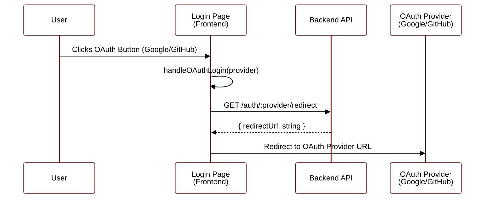
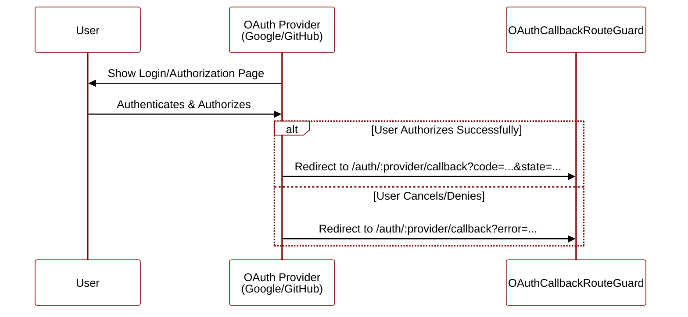
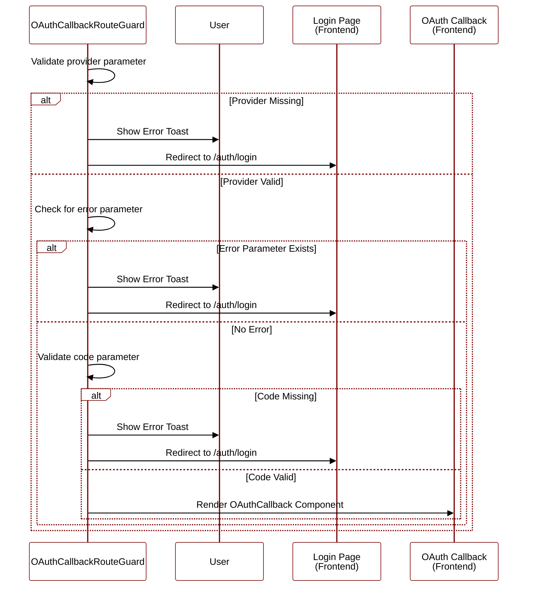
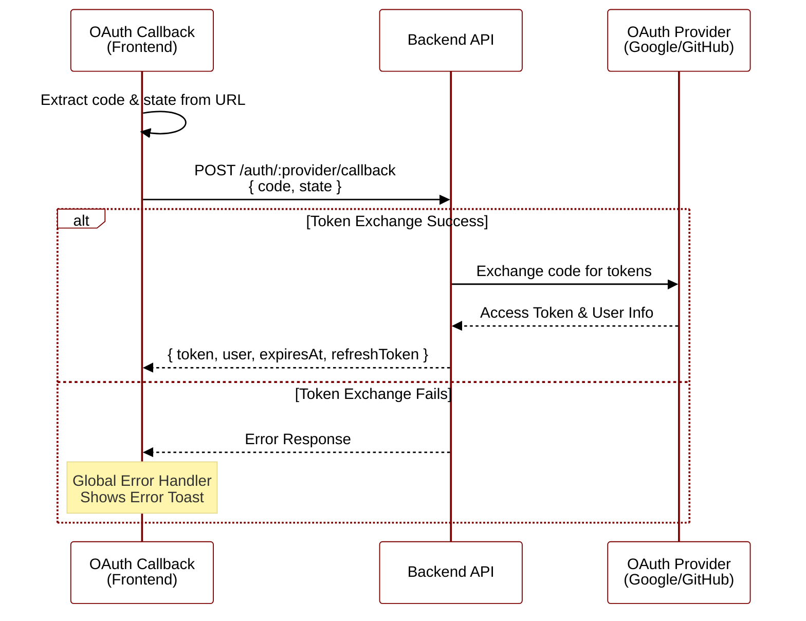
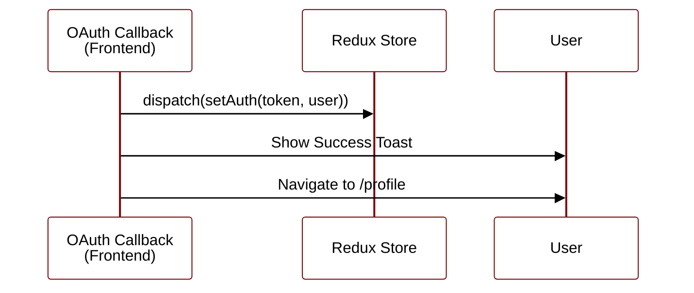

# OAuth Flow Sequence Diagrams

## 1. Initiation Phase

## 2. Authorization Phase

## 3. Validation Phase

## 4. Token Exchange Phase

## 5. Authentication Phase

## Error Handling

| Error Scenario             | Handler              | Action                                   |
| -------------------------- | -------------------- | ---------------------------------------- |
| Missing Provider           | Route Guard          | Show error toast → Redirect to login     |
| OAuth Error Parameter      | Route Guard          | Show error toast → Redirect to login     |
| Missing Authorization Code | Route Guard          | Show error toast → Redirect to login     |
| Token Exchange Failure     | Global Error Handler | Show error toast → Stay on callback page |

## Flow Description

### 1. **Initiation Phase**

- User clicks OAuth button (Google/GitHub) on login page
- Frontend calls `oauthApi.getOAuthRedirect(provider)`
- Backend generates OAuth redirect URL with state parameter
- Frontend redirects user to OAuth provider

### 2. **Authorization Phase**

- User authenticates with OAuth provider (Google/GitHub)
- User authorizes the application
- OAuth provider redirects back to `/auth/:provider/callback` with authorization code

### 3. **Validation Phase**

- `OAuthCallbackRouteGuard` validates:
    - Provider parameter exists
    - No error parameter in URL
    - Authorization code exists
- If validation fails, shows error and redirects to login

### 4. **Token Exchange Phase**

- `OAuthCallback` component calls `oauthApi.handleOAuthCallback(provider, {code, state})`
- Backend exchanges authorization code for access tokens
- Backend returns user data and tokens

### 5. **Authentication Phase**

- `dispatch(setAuth(token, user))` stores tokens and user in Redux
- Success toast is shown
- User is redirected to profile page

## Components Involved

- **Login Page** (`pages/login/login.tsx`): Initiates OAuth flow
- **OAuth Callback Guard** (`pages/oauth-callback/guards/oauth-callback-route.guard.tsx`): Validates callback parameters
- **OAuth Callback Page** (`pages/oauth-callback/oauth-callback.tsx`): Handles callback and token exchange
- **OAuth API** (`apis/oauth.api.ts`): API methods for OAuth operations
- **Auth Slice** (`store/auth/auth.slice.ts`): Redux slice for authentication state

## API Endpoints

- `GET /auth/:provider/redirect` - Get OAuth redirect URL
- `POST /auth/:provider/callback` - Exchange authorization code for tokens

## Error Handling

- **Missing Provider**: Guard redirects to login with error toast
- **OAuth Error**: Guard checks error parameter and redirects to login
- **Missing Code**: Guard redirects to login with error toast
- **API Errors**: Handled by global error interceptor
