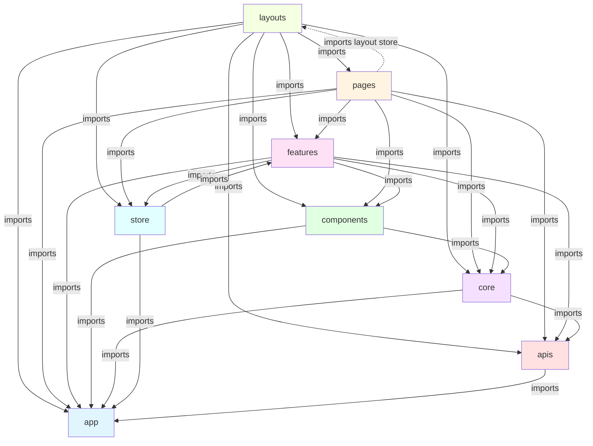

# Project Architecture

## Table of Contents

- [Structure Principles](#structure-principles)
    - [Layer Hierarchy](#layer-hierarchy)
    - [Layer Dependencies Diagram](#layer-dependencies-diagram)
- [Project Structure](#project-structure)
- [Import Rules](#import-rules)
- [Folder Responsibilities](#folder-responsibilities)
    - [APIs Folder](#apis-folder)
    - [App Folder](#app-folder)
    - [Components Folder](#components-folder)
    - [Layout Folder](#layouts-folder)
    - [Pages Folder](#pages-folder)
    - [Features Folder](#features-folder)
    - [Core Folder](#core-folder)
    - [Store Folder](#store-folder)

---

## Structure Principles

### Layer Hierarchy

1. **layouts** - Layout components that provide structural containers for pages
2. **pages** - Complete application pages with page-specific business logic and route mapping
3. **features** - Shared business logic, ViewModels, and features used across the application
4. **components** - Reusable UI components
5. **core** - React-specific shared resources (hooks, contexts, guards)
6. **store** - Global application state management
7. **apis** - API client, API functions, request models, and response models
8. **app** - Application configuration, assets, constants, enums, and utilities

### Layer Dependencies Diagram

The following diagram illustrates the dependency relationships between layers. Arrows indicate allowed import directions (higher layers can import from lower layers):



**Key Rules:**

- **Downward dependencies only**: Higher layers can import from lower layers, but not the reverse
- **No circular dependencies**: Each layer must maintain a clear dependency hierarchy
- **Layouts is top-most**: Layouts can import pages for routing configuration
- **Pages can access layout store**: Pages can only import the store from layouts, not other layout artifacts
- **Store is accessible**: `layouts`, `pages`, and `features` can access the global store
- **APIs is centralized**: All API calls, request models, and response models are in `apis`
- **App is foundational**: All layers can depend on `app` (configs, constants, enums, utils), but `app` has no dependencies

---

## Project Structure

```text
📁 src/
├── 📁 apis/         # API client, API functions, and models
│   ├── 📁 models/   # Request and response models
│   │   ├── 📄 auth.model.ts
│   │   ├── 📄 oauth.model.ts
│   │   ├── 📄 user.model.ts
│   │   └── 📄 index.ts
│   ├── 📄 client.ts      # API client with interceptors
│   ├── 📄 auth.api.ts    # Auth API functions
│   ├── 📄 oauth.api.ts   # OAuth API functions
│   ├── 📄 user.api.ts    # User API functions
│   ├── 📄 storage.api.ts # Storage API functions
│   └── 📄 index.ts       # Barrel exports
│
├── 📁 app/          # Application configuration, assets, constants, enums, and utilities
│   ├── 📁 assets/   # Images, fonts, icons
│   ├── 📁 configs/  # App, API, routes configuration
│   ├── 📁 constants/# Application constants
│   ├── 📁 enums/    # TypeScript enums
│   ├── 📁 utils/    # Utility functions
│   └── 📁 styles/   # Global styles
│
├── 📁 pages/        # Complete application pages
│   ├── 📁 login/
│   ├── 📁 signup/
│   ├── 📁 profile/
│   │   ├── 📁 components/ # Page-specific components
│   │   └── ...
│   └── ...
│
├── 📁 features/     # Business logic, ViewModels, and features
│   ├── 📁 user/
│   │   ├── 📁 models/     # ViewModels for UI
│   │   │   ├── 📄 user.model.ts
│   │   │   └── 📄 index.ts
│   │   └── ...
│   └── ...
│
├── 📁 layouts/      # Layout components
│   ├── 📁 client/
│   │   ├── 📁 store/      # Layout-specific state (optional)
│   │   ├── 📁 components/ # Layout-specific components
│   │   └── ...
│   ├── 📁 auth/
│   └── ...
│
├── 📁 components/   # Reusable UI components
│   ├── 📄 button.tsx
│   ├── 📄 input.tsx
│   ├── 📄 modal.tsx
│   └── ...
│
├── 📁 core/         # React-specific shared resources
│   ├── 📁 hooks/
│   ├── 📁 contexts/
│   └── 📁 guards/
│
├── 📁 store/        # Global application state management
│   ├── 📁 auth/     # Authentication state slice
│   ├── 📁 user/     # User state slice
│   └── 📄 index.ts  # Store configuration and root reducer
│
├── 📄 main.tsx
└── 📄 app.tsx
```

---

## Import Rules

```text
layouts    → pages, features, components, core, store, apis, app
pages      → layouts (store only), features, components, core, store, apis, app
features   → components, core, store, apis, app
components → core, app
core       → apis, app
store      → features (models only), app
apis       → app
app        → (no imports from other layers)
```

---

## Folder Responsibilities

### APIs Folder

Centralized location for all API-related code including the API client, API functions, request models, and response models.

**Contents:**

- **client.ts**: API client with interceptors, authentication, and error handling
- **{domain}.api.ts**: API functions organized by domain (auth, user, oauth, storage)
- **models/**: Request and response model interfaces
    - **{domain}.model.ts**: Models for each API domain

**Model Types (in `apis/models/`):**

- **RequestModel**: Data sent to the API (e.g., `LoginRequestModel`, `SignupRequestModel`)
- **ResponseModel**: Data received from the API (e.g., `AuthResponseModel`, `UserProfileResponseModel`)

**Rules:**

- Can only import from `app` (constants, configs, utils)
- Contains no React code
- All API functions should be pure async functions

---

### App Folder

Contains application-wide configurations, static assets, constants, enums, and utilities.

**Contents:**

- **configs/**: Application, API, and routes configuration
- **constants/**: Application-wide constants (API endpoints, keys, etc.)
- **enums/**: TypeScript enums for type-safe values
- **utils/**: Pure utility functions (no React dependencies)
- **assets/**: Static assets (images, fonts, icons)
- **styles/**: Global CSS styles

**Rules:**

- No imports from other layers
- No React-specific code (use `core` for React utilities)
- All exports should be pure TypeScript

---

### Components Folder

Pure UI components without business logic.

**Characteristics:**

- Presentational components only
- No API calls or business logic
- Accept data via props
- Emit events via callbacks
- Reusable across the entire application

**Rules:**

- Can only import from `core` and `app`
- Should not contain any business logic
- Should be stateless or contain only UI-related state

---

### Layouts Folder

Layout components that provide structural containers for pages.

**Responsibilities:**

- **Page Containers**: Provide consistent structural containers that accommodate multiple pages
- **Layout Consistency**: Ensure consistent spacing, positioning, and visual structure across pages

**Rules:**

- Similar to components - no business logic
- Focus on structural concerns (header, footer, sidebar, content area)
- May contain navigation components

**Layout Store:**

Layouts can have their own store at `src/layouts/{layout}/store/` for layout-specific state management.

**Layout Store Access Rules:**

- If a layout has a store, only the **top-most page component** matching the route can access that layout's store
- Child components within the page should NOT directly access the layout store
- Data from layout store should be passed down via props to child components

---

### Pages Folder

Complete page components that compose features and components. Pages can contain business logic that is specific to that page and not reused across the application.

**Responsibilities:**

- **Route Mapping**: Handle route parameters, URL state, and navigation logic specific to the page
- **Page-Specific Business Logic**: Can contain business logic that is unique to the page and not reused
- **Composition**: Pages compose features and components together
- **Authorization**: Check permissions and access control at page level
- **Data Orchestration**: Coordinate multiple features on the same page
- **Error Boundaries**: Handle page-level errors and loading states

**Rules:**

- Can import from `features`, `components`, `core`, `store`, `apis`, and `app`
- Page-specific components can be defined locally in the page folder
- Reusable business logic should be moved to `features`

**Page Store:**

For complex page-specific state that needs to be managed with Redux, create a page store at `src/pages/{page}/store/`. Use page stores only when:

- State is complex and benefits from Redux patterns
- State needs to persist across page remounts
- State management logic is too complex for `useState` or `useReducer`

**Page Store Access Rules:**

- If a page has a store, **components within that page** can access the page store
- Components outside the page folder should NOT access the page store
- Feature components used within the page should receive data via props, not by directly accessing the page store

**When NOT to use Page Store:**

- Simple state that can be managed with `useState`
- State that needs to be shared with other pages (use global store instead)
- Temporary UI state (use component state)

---

### Features Folder

Business logic, ViewModels, and feature-specific components that are **shared across the application**. Features accommodate reusable business logic that can be used by multiple pages or components.

**Responsibilities:**

- **ViewModels**: Define ViewModels for UI representation (transformed from API response models)
- **Shared Business Logic**: Accommodate business logic that is reused across multiple pages or components
- **Reusable Components**: Feature-specific components that can be composed in different pages
- **Business Rules**: Implement business rules and validation logic that applies to the feature

**Rules:**

- Can import from `components`, `core`, `store`, `apis`, and `app`
- Should contain logic that is reused across multiple pages
- Page-specific logic should remain in the page folder

**ViewModel Pattern:**

ViewModels represent data as used in the UI, potentially transformed from API response models:

- **Twin models** (identical to response): Can be a type alias or duplicate interface
- **Transformed models**: Map response data to UI-specific structure

**Encapsulation:**

- Features should focus on sharing business logic primarily via **components** and **ViewModels**
- If a feature needs to expose functionality, prefer exposing it through a component or hook rather than raw types/models

---

### Core Folder

React-specific shared resources for hooks, contexts, and guards.

**Contents:**

- **hooks/**: Reusable React hooks
- **contexts/**: React context providers
- **guards/**: Route guards and authentication wrappers

**Core Layer Dependencies (Higher can depend on Lower):**

```text
guards   → hooks, contexts, apis, app
contexts → hooks, apis, app
hooks    → apis, app
```

**Rules:**

- Can import from `apis` and `app`
- Contains React-specific utilities
- Should not contain feature-specific business logic

---

### Store Folder

Global application state management using Redux Toolkit. The store manages application-wide state that needs to be shared across multiple features or pages.

**Responsibilities:**

- **Global State Management**: Manage application-wide state that needs to be shared across multiple pages
- **Cross-Page State**: Handle state that spans multiple pages (e.g., authentication, user profile)
- **State Synchronization**: Ensure consistent state across the application
- **Unidirectional Data Flow**: Can dispatch actions from another store slice, but must maintain unidirectional flow (no circular dispatches)
- **No Side Effects**: Store should not perform side effects such as calling APIs to update data

**Store Rules:**

1. **Global State Only**: Store should only contain state that is truly global or shared across multiple pages. Page-specific state should remain in page folders.

2. **Slice Organization**: Each domain (auth, user, etc.) should have its own slice in a dedicated folder:

    ```text
    store/
    ├── auth/
    │   ├── auth.slice.ts
    │   └── index.ts
    ├── user/
    │   ├── user.slice.ts
    │   └── index.ts
    └── index.ts
    ```

3. **Type Safety**: Always export and use typed hooks (`useAppSelector`, `useAppDispatch`).

4. **Action Naming**: Use clear, descriptive action names following the pattern: `verbNoun` (e.g., `setToken`, `clearUser`, `updateUser`).

5. **Immutability**: Never mutate state directly. Redux Toolkit's `createSlice` handles immutability automatically.

6. **No Side Effects in Store**: Store reducers must be pure functions with no side effects. API calls, localStorage operations, and other side effects must be handled outside the store.

7. **Page Store vs Global Store**:
    - **Global Store** (`src/store/`): State shared across multiple pages (auth, user, theme, etc.)
    - **Page Store** (`src/pages/{page}/store/`): Page-specific state that is only used within that page

8. **Import Rules**: Store can import from `features` (models only) and `app`. Store should NOT import from `pages`, `components`, or `core`.

9. **Cross-Slice Actions**: Store slices can dispatch actions from other slices, but must ensure unidirectional flow to prevent circular dependencies.

**Store Layer Dependencies:**

```text
store → features (models only), app
```
