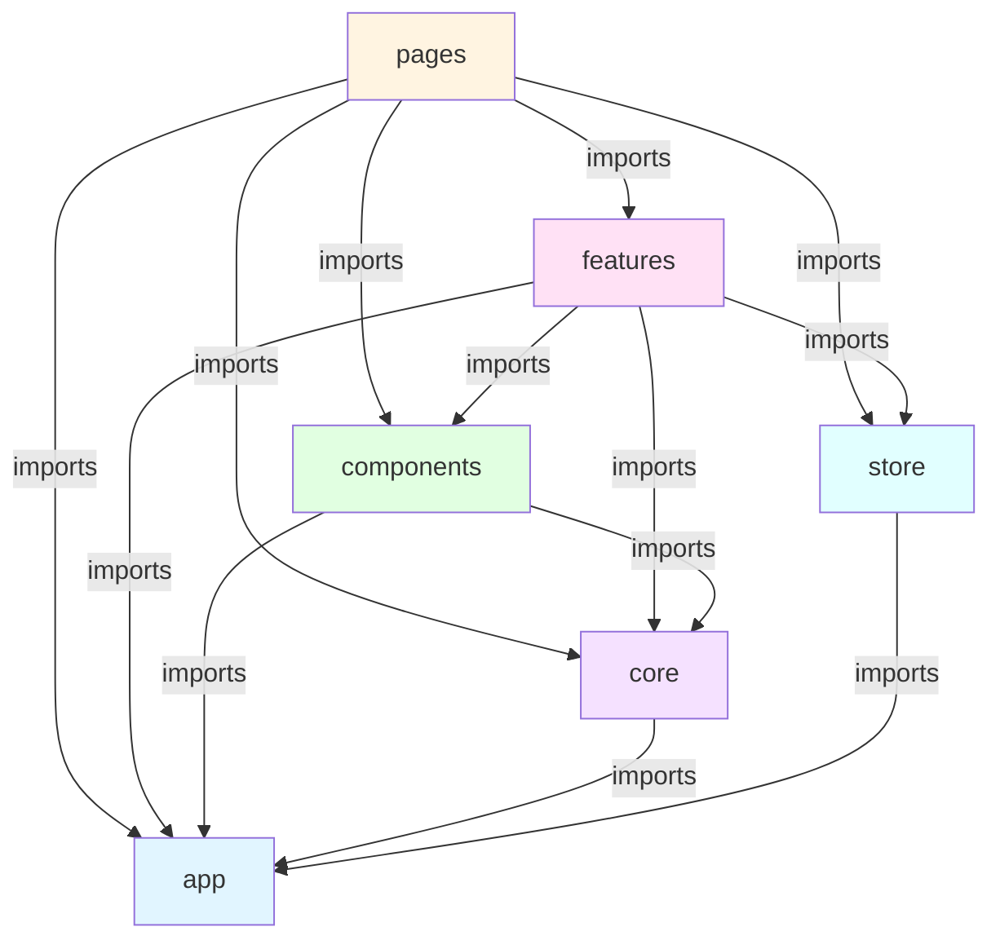

# Project Architecture

This document describes the architectural methodology and structure principles. For code examples and implementation patterns, see [best-practices.md](./best-practices.md).

## Table of Contents

- [Structure Principles](#structure-principles)
    - [Layer Hierarchy](#layer-hierarchy)
    - [Layer Dependencies Diagram](#layer-dependencies-diagram)
- [Project Structure](#project-structure)
- [Import Rules](#import-rules)
- [Folder Responsibilities](#folder-responsibilities)
    - [App Folder](#app-folder)
    - [Components Folder](#components-folder)
    - [Layout Folder](#layout-folder)
    - [Pages Folder](#pages-folder)
    - [Features Folder](#features-folder)
    - [Core Folder](#core-folder)
    - [Store Folder](#store-folder)

---

## Structure Principles

### Layer Hierarchy

1. **app** - Application configuration, assets, constants, enums, and utilities
2. **pages** - Complete application pages with page-specific business logic and route mapping
3. **features** - Shared business logic and features used across the application
4. **components** - Reusable UI components
5. **core** - React-specific shared resources
6. **store** - Global application state management

### Layer Dependencies Diagram

The following diagram illustrates the dependency relationships between layers. Arrows indicate allowed import directions (higher layers can import from lower layers):



**Key Rules:**

- **Downward dependencies only**: Higher layers can import from lower layers, but not the reverse
- **No circular dependencies**: Each layer must maintain a clear dependency hierarchy
- **Store is accessible**: Both `pages` and `features` can access the global store
- **App is foundational**: All layers can depend on `app` (configs, constants, enums, utils), but `app` has no dependencies

---

## Project Structure

```text
📁 src/
├── 📁 app/          # Application configuration, assets, constants, enums, and utilities
│   ├── 📁 assets/   # Images, fonts, icons
│   ├── 📁 configs/  # App, API, routes configuration
│   ├── 📁 constants/# Application constants
│   ├── 📁 enums/    # TypeScript enums
│   ├── 📁 utils/    # Utility functions
│   └── 📁 styles/   # Global styles
│
├── 📁 pages/        # Complete application pages
│   ├── 📁 accounts/
│   │   ├── 📁 store/  # Page-specific state (optional)
│   │   ├── 📁 models/ # Page-specific models (optional)
│   │   ├── 📁 enums/  # Page-specific enums (optional)
│   │   └── ...
│   ├── 📁 auth/
│   └── ...
│
├── 📁 features/     # Business logic and features
│   ├── 📁 accounts/
│   │   ├── 📁 components/    # Feature components
│   │   │   ├── 📁 account-list/
│   │   │   ├── 📁 account-create/
│   │   │   └── ...
│   │   ├── 📁 apis/          # APIs for the feature domain
│   │   ├── 📁 models/        # Feature-specific models (optional)
│   │   ├── 📁 enums/         # Feature-specific enums (optional)
│   │   └── ...
│   ├── 📁 auth/
│   └── ...
│
├── 📁 components/   # Reusable UI components
│   ├── 📁 button/
│   ├── 📁 modal/
│   ├── 📁 form/
│   └── ...
│
├── 📁 core/         # React-specific shared resources
│   ├── 📁 hooks/
│   ├── 📁 contexts/
│   ├── 📁 apis/
│   └── 📁 guards/
│
├── 📁 store/        # Global application state management
│   ├── 📁 auth/     # Authentication state slice
│   ├── 📁 user/     # User state slice
│   └── 📄 index.ts  # Store configuration and root reducer
│
├── 📄 main.tsx
└── 📄 app.tsx
```

---

## Import Rules

```text
pages      → features, components, core, store, app
features   → components, core, store, app
components → core, app
core       → app
store      → app
app        → (no imports from other layers)
```

---

## Folder Responsibilities

### App Folder

Contains application-wide configurations, static assets, constants, enums, and utilities.

**Contents:**

- **configs/**: Application, API, and routes configuration
- **constants/**: Application-wide constants (API endpoints, keys, etc.)
- **enums/**: TypeScript enums for type-safe values
- **utils/**: Pure utility functions (no React dependencies)
- **assets/**: Static assets (images, fonts, icons)
- **styles/**: Global CSS styles

**Rules:**

- No imports from other layers
- No React-specific code (use `core` for React utilities)
- All exports should be pure TypeScript

---

### Components Folder

Pure UI components without business logic.

**Characteristics:**

- Presentational components only
- No API calls or business logic
- Accept data via props
- Emit events via callbacks
- Reusable across the entire application

**Rules:**

- Can only import from `core` and `app`
- Should not contain any business logic
- Should be stateless or contain only UI-related state

---

### Layout Folder

Layout components that provide structural containers for pages.

**Responsibilities:**

- **Page Containers**: Provide consistent structural containers that accommodate multiple pages
- **Layout Consistency**: Ensure consistent spacing, positioning, and visual structure across pages
- **Responsive Structure**: Handle responsive layout behavior and breakpoints

**Rules:**

- Similar to components - no business logic
- Focus on structural concerns (header, footer, sidebar, content area)
- May contain navigation components

---

### Pages Folder

Complete page components that compose features and components. Pages can contain business logic that is specific to that page and not reused across the application.

**Responsibilities:**

- **Route Mapping**: Handle route parameters, URL state, and navigation logic specific to the page
- **Page-Specific Business Logic**: Can contain business logic that is unique to the page and not reused
- **Composition**: Pages compose features and components together
- **Authorization**: Check permissions and access control at page level
- **Data Orchestration**: Coordinate multiple features on the same page
- **Error Boundaries**: Handle page-level errors and loading states

**Rules:**

- Can import from `features`, `components`, `core`, `store`, and `app`
- Page-specific models can be defined locally in the page folder if reusability is uncertain
- APIs should be located in `features`, not in `pages` - pages should import APIs from features
- Reusable business logic should be moved to `features`

**Page Store:**

For complex page-specific state that needs to be managed with Redux, create a page store at `src/pages/{page}/store/`. Use page stores only when:

- State is complex and benefits from Redux patterns
- State needs to persist across page remounts
- State management logic is too complex for `useState` or `useReducer`

**When NOT to use Page Store:**

- Simple state that can be managed with `useState`
- State that needs to be shared with other pages (use global store instead)
- Temporary UI state (use component state)

---

### Features Folder

Business logic and feature-specific components that are **shared across the application**. Features accommodate reusable business logic that can be used by multiple pages or components.

**Responsibilities:**

- **Shared Business Logic**: Accommodate business logic that is reused across multiple pages or components
- **Reusable Components**: Feature-specific components that can be composed in different pages
- **API Integration**: Handle API calls and data transformation for the feature
- **Business Rules**: Implement business rules and validation logic that applies to the feature

**Rules:**

- Can import from `components`, `core`, `store`, and `app`
- Should contain logic that is reused across multiple pages
- Page-specific logic should remain in the page folder

**API Location:**

- All APIs related to features should be located in the `features` directory, not in `pages`
- API models (request/response types) should be simple raw objects without complex model definitions
- Pages should import and use APIs from `features` rather than defining their own

**Encapsulation:**

- Features should focus on sharing business logic primarily via **components**
- Minimize the sharing of individual artifacts (models, enums, types, etc.) except for APIs
- If a feature needs to expose functionality, prefer exposing it through a component or hook rather than raw types/models

**Model Definitions:**

- Features can accommodate their own `models/`, `enums/`, and interfaces when needed for the feature domain
- If pages or other features contain feature-like models but their reusability is uncertain, it is acceptable to define those models locally within the `pages` or other `features` directory
- Only promote models to a shared feature level when they are clearly reused across multiple consumers
- Avoid premature abstraction - keep models local until reuse is proven

---

### Core Folder

React-specific shared resources for hooks, contexts, guards, and APIs.

**Contents:**

- **hooks/**: Reusable React hooks
- **contexts/**: React context providers
- **guards/**: Route guards and authentication wrappers
- **apis/**: API client and base API utilities

**Core Layer Dependencies (Higher can depend on Lower):**

```text
guards   → hooks, contexts, apis, app
contexts → hooks, apis, app
hooks    → apis, app
apis     → app
```

**Rules:**

- Can only import from `app`
- Contains React-specific utilities
- Should not contain feature-specific business logic

---

### Store Folder

Global application state management using Redux Toolkit. The store manages application-wide state that needs to be shared across multiple features or pages.

**Responsibilities:**

- **Global State Management**: Manage application-wide state that needs to be shared across multiple pages
- **Cross-Page State**: Handle state that spans multiple pages (e.g., authentication, user profile)
- **State Synchronization**: Ensure consistent state across the application
- **Unidirectional Data Flow**: Can dispatch actions from another store slice, but must maintain unidirectional flow (no circular dispatches)
- **No Side Effects**: Store should not perform side effects such as calling APIs to update data

**Store Rules:**

1. **Global State Only**: Store should only contain state that is truly global or shared across multiple pages. Page-specific state should remain in page folders.

2. **Slice Organization**: Each domain (auth, user, etc.) should have its own slice in a dedicated folder:

    ```text
    store/
    ├── auth/
    │   ├── auth.slice.ts
    │   └── index.ts
    ├── user/
    │   ├── user.slice.ts
    │   └── index.ts
    └── index.ts
    ```

3. **Type Safety**: Always export and use typed hooks (`useAppSelector`, `useAppDispatch`).

4. **Action Naming**: Use clear, descriptive action names following the pattern: `verbNoun` (e.g., `setToken`, `clearUser`, `updateUser`).

5. **Immutability**: Never mutate state directly. Redux Toolkit's `createSlice` handles immutability automatically.

6. **No Side Effects in Store**: Store reducers must be pure functions with no side effects. API calls, localStorage operations, and other side effects must be handled outside the store.

7. **Page Store vs Global Store**:
    - **Global Store** (`src/store/`): State shared across multiple pages (auth, user, theme, etc.)
    - **Page Store** (`src/pages/{page}/store/`): Page-specific state that is only used within that page

8. **Import Rules**: Store can import from `app` only. Store should NOT import from `pages`, `features`, `components`, or `core`.

9. **Cross-Slice Actions**: Store slices can dispatch actions from other slices, but must ensure unidirectional flow to prevent circular dependencies.

**Store Layer Dependencies:**

```text
store → app
```
