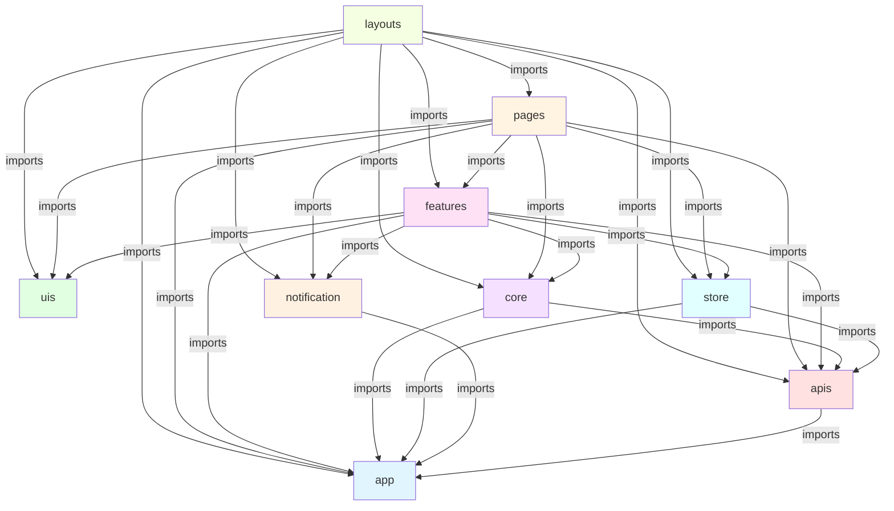

# Project Architecture

## Table of Contents

- [Structure Principles](#structure-principles)
    - [Layer Hierarchy](#layer-hierarchy)
    - [Layer Dependencies Diagram](#layer-dependencies-diagram)
- [Project Structure](#project-structure)
- [Import Rules](#import-rules)
- [Folder Responsibilities](#folder-responsibilities)
    - [APIs Folder](#apis-folder)
    - [App Folder](#app-folder)
    - [Uis Folder](#uis-folder)
    - [Layout Folder](#layouts-folder)
    - [Pages Folder](#pages-folder)
    - [Features Folder](#features-folder)
    - [Core Folder](#core-folder)
    - [Store Folder](#store-folder)
    - [Notification Folder](#notification-folder)

---

## Structure Principles

### Layer Hierarchy

1. **layouts** - Layout components that provide structural containers for pages
2. **pages** - Complete application pages with page-specific business logic and route mapping
3. **features** - Shared business logic, feature models, and feature components used across the application
4. **uis** - Reusable UI components
5. **core** - React-specific shared resources (hooks, contexts, guards)
6. **store** - Global application state management
7. **notification** - Real-time notification transport (SignalR connection hook + shared payload model/enum/constant)
8. **apis** - API client + one folder per domain (fetchers, wire types, mapped models, mappers, endpoints, query keys)
9. **app** - Application configuration, assets, constants, enums, and utilities

### Layer Dependencies Diagram

The following diagram illustrates the dependency relationships between layers. Arrows indicate allowed import directions (higher layers can import from lower layers):


```mermaid
graph TD
    Layouts[layouts]
    Pages[pages]
    Features[features]
    Uis[uis]
    Core[core]
    Store[store]
    Notification[notification]
    APIs[apis]
    App[app]

    Layouts -->|imports| Pages
    Layouts -->|imports| Features
    Layouts -->|imports| Uis
    Layouts -->|imports| Core
    Layouts -->|imports| Store
    Layouts -->|imports| Notification
    Layouts -->|imports| APIs
    Layouts -->|imports| App

    Pages -->|imports| Features
    Pages -->|imports| Uis
    Pages -->|imports| Core
    Pages -->|imports| Store
    Pages -->|imports| Notification
    Pages -->|imports| APIs
    Pages -->|imports| App

    Features -->|imports| Uis
    Features -->|imports| Core
    Features -->|imports| Store
    Features -->|imports| Notification
    Features -->|imports| APIs
    Features -->|imports| App

    Core -->|imports| APIs
    Core -->|imports| App

    Store -->|imports| APIs
    Store -->|imports| App

    Notification -->|imports| App

    APIs -->|imports| App

    style Layouts fill:#f5ffe1
    style Pages fill:#fff4e1
    style Features fill:#ffe1f5
    style Uis fill:#e1ffe1
    style Core fill:#f5e1ff
    style Store fill:#e1ffff
    style Notification fill:#fff1e1
    style APIs fill:#ffe1e1
    style App fill:#e1f5ff
```

**Key Rules:**

- **Downward dependencies only**: Higher layers can import from lower layers, but not the reverse
- **No circular dependencies**: Each layer must maintain a clear dependency hierarchy
- **Layouts is top-most**: Layouts can import pages for routing configuration
- **Store is accessible**: `layouts`, `pages`, and `features` can access the global store
- **APIs is per-domain**: All API calls, wire types, mapped models, endpoints, and query keys live under `apis/<domain>/`
- **App is foundational**: All layers can depend on `app` (configs, constants, enums, utils), but `app` has no dependencies
- **Uis has no dependencies**: `uis` is pure presentational components and does not import from any other layer

---

## Project Structure

```text
📁 src/
├── 📁 apis/                       # API layer — one folder per domain
│   ├── 📁 <domain>/               # e.g. auth, user, order, admin
│   │   ├── 📄 <domain>.api.ts        # API functions (fetchers)
│   │   ├── 📄 <domain>.request.ts    # *RequestModel — request payload types
│   │   ├── 📄 <domain>.response.ts   # *ResponseModel — raw wire types (api-internal)
│   │   ├── 📄 <domain>.model.ts      # *Model — mapped, UI-facing types
│   │   ├── 📄 <domain>.mapper.ts     # to* functions: response → model
│   │   ├── 📄 <domain>.constant.ts   # <DOMAIN>_ENDPOINTS + <DOMAIN>_QUERY_KEYS
│   │   └── 📄 index.ts               # Barrel exports
│   ├── 📄 client.ts               # API client with interceptors
│   └── 📄 index.ts                # Barrel exports (re-exports every domain)
│
├── 📁 app/          # Application configuration, assets, constants, enums, and utilities
│   ├── 📁 assets/   # Images, fonts, icons
│   ├── 📁 configs/  # App, API, routes configuration
│   ├── 📁 constants/# Application constants
│   ├── 📁 types/    # TypeScript enums and types (folder renamed from `enums/`; files use the `.type.ts` suffix)
│   ├── 📁 i18n/     # i18next setup and locale translation files (en, vi)
│   ├── 📁 utils/    # Utility functions
│   │   └── 📁 __tests__/ # Utility unit tests
│   └── 📁 styles/   # Global styles
│
├── 📁 pages/        # Complete application pages
│   ├── 📁 login/
│   ├── 📁 signup/
│   ├── 📁 profile/
│   │   ├── 📁 components/
│   │   │   ├── 📁 __tests__/ # Page-specific component tests
│   │   │   └── ...
│   │   ├── 📁 __tests__/     # Page-level integration tests
│   │   └── ...
│   └── ...
│
├── 📁 features/     # Business logic and features
│   ├── 📁 user/
│   │   ├── 📁 models/     # Feature models — UI-only/composed types, not mapped from API
│   │   │   ├── 📄 user.model.ts
│   │   │   └── 📄 index.ts
│   │   ├── 📁 components/
│   │   │   ├── 📁 __tests__/ # Feature component tests
│   │   │   └── ...
│   │   └── ...
│   ├── 📁 cart/
│   │   ├── 📁 store/      # Feature-owned Redux slice (registered via src/store/index.ts)
│   │   ├── 📁 hooks/
│   │   └── ...
│   └── ...
│
├── 📁 layouts/      # Layout components
│   ├── 📁 client/
│   │   ├── 📁 store/      # Layout-specific state (optional)
│   │   ├── 📁 components/ # Layout-specific components
│   │   └── ...
│   ├── 📁 auth/
│   └── ...
│
├── 📁 uis/          # Reusable UI components
│   ├── 📁 __tests__/ # Shared component unit tests
│   ├── 📄 button.tsx
│   ├── 📄 input.tsx
│   ├── 📄 modal.tsx
│   └── ...
│
├── 📁 core/         # React-specific shared resources
│   ├── 📁 hooks/
│   ├── 📁 contexts/
│   └── 📁 guards/
│
├── 📁 store/        # Global application state management
│   ├── 📁 auth/     # Authentication state slice
│   ├── 📁 user/     # User state slice
│   └── 📄 index.ts  # Store configuration and root reducer
│
├── 📁 notification/ # Real-time notification transport (flat, one folder — see Notification Folder)
│   ├── 📄 use-notifications.hook.ts
│   ├── 📄 notification.model.ts
│   ├── 📄 notification.type.ts
│   ├── 📄 hubs.constant.ts
│   └── 📄 index.ts
│
├── 📄 main.tsx
└── 📄 app.tsx

📁 test/             # Global test setup and utilities
├── 📄 setup.ts      # jest-dom matchers setup
└── 📄 utils.tsx     # renderWithProviders, createTestQueryClient

📁 mocks/            # MSW mock infrastructure (dev + test)
├── 📄 browser.ts    # Browser service worker setup
├── 📄 index.ts
├── 📄 utils.ts
├── 📁 handlers/     # Request handlers per domain
│   ├── 📄 index.ts
│   ├── 📄 food.handlers.ts
│   └── 📄 admin-*.handlers.ts
└── 📁 data/         # Static mock data (JSON + TS)
```

---

## Import Rules

```text
layouts      → pages, features, uis, core, store, notification, apis, app
pages        → features, uis, core, store, notification, apis, app
features     → uis, core, store, notification, apis, app
uis          → (no imports from other layers)
core         → apis, app
store        → apis (models only), app
notification → app
apis         → app
app          → (no imports from other layers)
```

---

## Folder Responsibilities

### APIs Folder

All API-related code, organized **one folder per domain** under `apis/<domain>/`. Each domain owns its fetchers, wire types, mapped models, mapper, endpoints, and query keys — nothing is shared across domains.

**Per-domain contents (`apis/<domain>/`):**

- **{domain}.api.ts**: API functions (pure async fetchers) for the domain
- **{domain}.request.ts**: `*RequestModel` — request payload types
- **{domain}.response.ts**: `*ResponseModel` — raw API wire types (api-layer internal)
- **{domain}.model.ts**: `*Model` — mapped, UI-facing types produced by the mapper
- **{domain}.mapper.ts**: `to*` functions mapping a `*ResponseModel` → `*Model`
- **{domain}.constant.ts**: `<DOMAIN>_ENDPOINTS` (URL constants) + `<DOMAIN>_QUERY_KEYS` (React Query keys)
- **index.ts**: barrel re-export of the domain
- **client.ts** (top level): API client with interceptors, authentication, and error handling

**Model types:**

- **`*Model`** (api layer): the mapped, UI-facing type. This is what app layers consume (via the `@/apis` barrel).
- **`*ResponseModel`** / **`*RequestModel`** (api layer, internal): raw wire types. Must NOT be imported outside `src/apis/**` — consume the mapped `*Model` or call the api function instead (enforced by eslint).
- Feature-owned models live in the **feature layer** (`features/{domain}/models/`), never here — see naming.md.

**Rules:**

- Can only import from `app` (constants, configs, utils)
- Contains no React code
- All API functions should be pure async functions
- Endpoint URLs and query keys are co-located per domain — there is no central `API_ENDPOINTS` object

---

### App Folder

Contains application-wide configurations, static assets, constants, enums, utilities, and i18n setup.

**Contents:**

- **configs/**: Application, API, and routes configuration
- **constants/**: Application-wide constants (API endpoints, keys, etc.)
- **types/**: TypeScript enums and types for type-safe values (folder renamed from `enums/`; files use the `.type.ts` suffix — `enum` and `type` share one naming/filing convention, see naming.md)
- **i18n/**: i18next initialization (`i18n.ts`) and locale translation files (`locales/en.json`, `locales/vi.json`)
- **utils/**: Pure utility functions (no React dependencies); unit tests live in `utils/__tests__/`
- **assets/**: Static assets (images, fonts, icons)
- **styles/**: Global CSS styles

**Rules:**

- No imports from other layers
- No React-specific code (use `core` for React utilities)
- All exports should be pure TypeScript

---

### Uis Folder

Pure UI components without business logic.

**Characteristics:**

- Presentational components only
- No API calls or business logic
- Accept data via props
- Emit events via callbacks
- Reusable across the entire application

**Rules:**

- Cannot import from any other layer (no `core`, `app`, `apis`, etc.)
- Should not contain any business logic
- Should be stateless or contain only UI-related state

---

### Layouts Folder

Layout components that provide structural containers for pages.

**Responsibilities:**

- **Page Containers**: Provide consistent structural containers that accommodate multiple pages
- **Layout Consistency**: Ensure consistent spacing, positioning, and visual structure across pages

**Rules:**

- Similar to components - no business logic
- Focus on structural concerns (header, footer, sidebar, content area)
- May contain navigation components

---

### Pages Folder

Complete page components that compose features and components. Pages can contain business logic that is specific to that page and not reused across the application.

**Responsibilities:**

- **Route Mapping**: Handle route parameters, URL state, and navigation logic specific to the page
- **Page-Specific Business Logic**: Can contain business logic that is unique to the page and not reused
- **Composition**: Pages compose features and components together
- **Authorization**: Check permissions and access control at page level
- **Data Orchestration**: Coordinate multiple features on the same page
- **Error Boundaries**: Handle page-level errors and loading states

**Rules:**

- Can import from `features`, `uis`, `core`, `store`, `apis`, and `app`
- Page-specific components can be defined locally in the page folder
- Reusable business logic should be moved to `features`

**Page Store:**

For complex page-specific state that needs to be managed with Redux, create a page store at `src/pages/{page}/store/`. Use page stores only when:

- State is complex and benefits from Redux patterns
- State needs to persist across page remounts
- State management logic is too complex for `useState` or `useReducer`

**Page Store Access Rules:**

- If a page has a store, **components within that page** can access the page store
- Components outside the page folder should NOT access the page store
- Feature components used within the page should receive data via props, not by directly accessing the page store

**When NOT to use Page Store:**

- Simple state that can be managed with `useState`
- State that needs to be shared with other pages (use global store instead)
- Temporary UI state (use component state)

---

### Features Folder

Business logic, feature models, and feature-specific components that are **shared across the application**. Features accommodate reusable business logic that can be used by multiple pages or components.

**Responsibilities:**

- **Feature models**: Define feature-owned models — UI-state or data composed/derived in the feature, NOT a 1:1 map of an API response (those are `*Model`s at the api layer)
- **Shared Business Logic**: Accommodate business logic that is reused across multiple pages or components
- **Reusable Components**: Feature-specific components that can be composed in different pages
- **Business Rules**: Implement business rules and validation logic that applies to the feature

**Rules:**

- Can import from `uis`, `core`, `store`, `apis`, and `app`
- May import from a sibling feature when domain coupling requires it (e.g. the `cart` feature depends on `food`'s pricing util) — keep this the exception, not the default
- Should contain logic that is reused across multiple pages
- Page-specific logic should remain in the page folder

**Feature Store:**

A feature can own Redux state at `src/features/{feature}/store/` (slice, thunks, selectors) when that state is cross-cutting enough to live in the global root reducer but conceptually belongs to the feature — e.g. `features/cart/store/`, `features/food/store/`. The global store (`src/store/**`) must never import from `features`; the sole exception is the root composition file `src/store/index.ts`, which registers each feature-owned reducer into `configureStore` purely as wiring, not business logic.

**Feature Model Pattern:**

A feature model is a `*Model` owned by the feature layer. Mapping an API response is **not** a feature concern — the mapper at the api layer produces a `*Model`. Reach for a feature model only when:

- the shape is UI-only state with no API counterpart, or
- it composes/derives data from one or more api `*Model`s into something no single endpoint returns.

If you just need an endpoint's shape, import its `*Model` from `@/apis` directly — do not wrap it in a feature model.

**Encapsulation:**

- Features should focus on sharing business logic primarily via **components** and hooks
- If a feature needs to expose functionality, prefer exposing it through a component or hook rather than raw types/models

---

### Core Folder

React-specific shared resources for hooks, contexts, and guards.

**Contents:**

- **hooks/**: Reusable React hooks, plus hook-adjacent React utilities they depend on (non-hook helpers, no `use-` prefix, e.g. `lazy-with-preload.hook.ts` backing `use-idle-preload.hook.ts`)
- **contexts/**: React context providers
- **guards/**: Route guards and authentication wrappers

**Core Layer Dependencies (Higher can depend on Lower):**

```text
guards   → hooks, contexts, apis, app
contexts → hooks, apis, app
hooks    → apis, app
```

**Rules:**

- Can import from `apis` and `app`
- Contains React-specific utilities
- Should not contain feature-specific business logic

---

### Store Folder

Global application state management using Redux Toolkit. The store manages application-wide state that needs to be shared across multiple features or pages.

**Responsibilities:**

- **Global State Management**: Manage application-wide state that needs to be shared across multiple pages
- **Cross-Page State**: Handle state that spans multiple pages (e.g., authentication, user profile)
- **State Synchronization**: Ensure consistent state across the application
- **Unidirectional Data Flow**: Can dispatch actions from another store slice, but must maintain unidirectional flow (no circular dispatches)
- **No Side Effects**: Store should not perform side effects such as calling APIs to update data

**Store Rules:**

1. **Global State Only**: Store should only contain state that is truly global or shared across multiple pages. Page-specific state should remain in page folders.

2. **Slice Organization**: Each domain (auth, user, etc.) should have its own slice in a dedicated folder:

    ```text
    store/
    ├── auth/
    │   ├── auth.slice.ts
    │   └── index.ts
    ├── user/
    │   ├── user.slice.ts
    │   └── index.ts
    └── index.ts
    ```

3. **Type Safety**: Always export and use typed hooks (`useAppSelector`, `useAppDispatch`).

4. **Action Naming**: Use clear, descriptive action names following the pattern: `verbNoun` (e.g., `setToken`, `clearUser`, `updateUser`).

5. **Immutability**: Never mutate state directly. Redux Toolkit's `createSlice` handles immutability automatically.

6. **No Side Effects in Store**: Store reducers must be pure functions with no side effects. API calls, localStorage operations, and other side effects must be handled outside the store.

7. **Page Store vs Global Store**:
    - **Global Store** (`src/store/`): State shared across multiple pages (auth, user, theme, etc.)
    - **Page Store** (`src/pages/{page}/store/`): Page-specific state that is only used within that page

8. **Import Rules**: Store can import from `apis` (models only) and `app`. Store should NOT import from `pages`, `features`, `uis`, or `core`. The root store composition file (`src/store/index.ts`) is the sole exception, since it must register reducers owned by feature-level stores (see Features Folder → Feature Store) — everywhere else in `src/store/**`, including cross-slice orchestration in thunks, must stay features-free.

9. **Cross-Slice Actions**: Store slices can dispatch actions from other slices, but must ensure unidirectional flow to prevent circular dependencies.

**Store Layer Dependencies:**

```text
store → apis (models only), app
```

---

### Notification Folder

Real-time notification transport: the SignalR connection hook plus its payload model, enum, and endpoint constant, as one flat, un-nested folder (`src/notification/`).

**Contents (flat — no subfolders, unlike `features/{x}/`):**

- **use-notifications.hook.ts**: SignalR connection lifecycle, reconnect handling, live-feed status
- **notification.model.ts**: `SharedNotification` discriminated union + payload interfaces (payment, refund, new-order)
- **notification.type.ts**: `NotificationType`
- **hubs.constant.ts**: `HUBS` endpoint map
- **index.ts**: barrel re-export of all four

**Rules:**

- Can only import from `app`
- Contains no business logic — payload shapes are data only, the hook is pure connection plumbing
- `layouts`, `pages`, and `features` may all import from it directly

**Notification Layer Dependencies:**

```text
notification → app
```

---

## Reference Implementations

These files serve as canonical examples of each pattern. When implementing a new feature, follow these as templates:

| Pattern                     | Reference File(s)                                                                                        |
| --------------------------- | -------------------------------------------------------------------------------------------------------- |
| **Feature Module**          | `src/features/food/` — hooks, components, feature-only models                                            |
| **Page with Data Fetching** | `src/pages/profile/` — page-specific components and data orchestration                                   |
| **API Module**              | `src/apis/order/` — per-domain api, wire types, mapped model, mapper, constant                           |
| **Redux Slice**             | `src/store/auth/` — slice definition, typed hooks, and actions                                           |
| **Feature Store**           | `src/features/cart/store/` — feature-owned slice registered into the root store via `src/store/index.ts` |
| **Shared UI Component**     | `src/uis/` — shadcn/ui-based reusable components                                                         |
| **Custom Hook**             | `src/core/hooks/use-auth.hook.ts` — React hook with context or business logic                            |
| **Hook-adjacent Utility**   | `src/core/hooks/lazy-with-preload.hook.ts` — React.lazy wrapper consumed by a hook, not a hook itself    |
| **Context Provider**        | `src/core/contexts/theme.context.tsx` — context setup and provider pattern                               |
| **Notification Layer**      | `src/notification/` — flat foundational layer, SignalR hook + shared payload model/enum/constant         |

Use these as templates: examine the full folder structure, naming conventions, import order, component memoization, and state management patterns from these examples.
